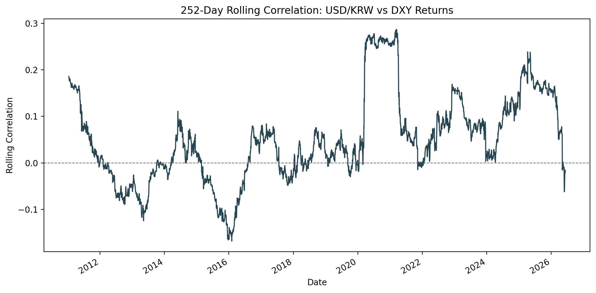
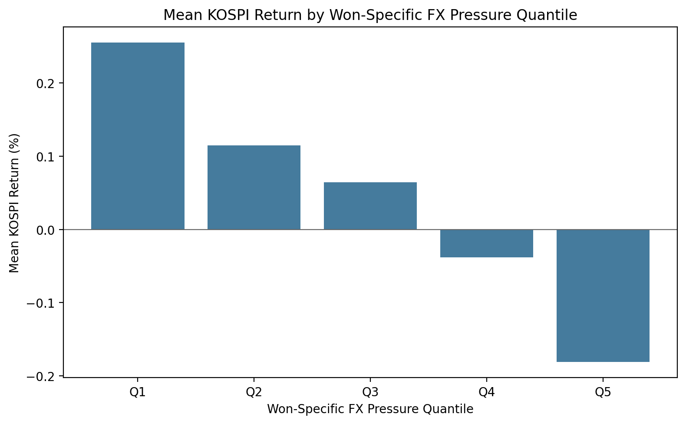

# Week 1. 달러가 강하면 KOSPI는 정말 약할까?

> 원/달러 환율, DXY, 외국인 수급으로 보는 한국 증시의 달러 민감도

환율이 오르면 한국 증시가 약해진다는 말은 금융시장 이야기에서 정말 자주 등장한다. 특히 원/달러 환율이 빠르게 오르는 날에는 외국인 자금 이탈, 위험회피 심리, 대외 불확실성 확대 같은 설명이 한꺼번에 따라붙는다.

하지만 자주 쓰이는 설명이라고 해서 자동으로 사실이 되는 것은 아니다. 실제 데이터에서도 그런 경향이 반복되는지, 그리고 최근처럼 원화 약세를 단순 달러 강세만으로 설명하기 어려운 국면에서도 같은 해석이 여전히 유효한지는 따로 확인해 볼 필요가 있다.

이번 글에서는 그 질문을 기존 연구, 최근 시장 맥락, Python 데이터 분석 결과와 연결해서 살펴본다. 이 글은 투자 추천이 아니라, 시장 통념을 데이터로 검증해 보는 교육 및 포트폴리오 목적의 리서치 노트다. 참고자료는 `week1/notes/references.md`, 해석 프레임은 `week1/notes/research_context.md`에서 함께 볼 수 있다.

이 글의 수준은 Level 3 / 5다.

- 대상 독자: 경제·금융 전공자
- 대상 독자: 금융권 데이터 분석 직무 취업 준비자
- 대상 독자: Python으로 금융 데이터를 읽어 보고 싶은 독자
- 글 안에서 다루는 개념: 수익률
- 글 안에서 다루는 개념: 상관관계
- 글 안에서 다루는 개념: 분위수
- 글 안에서 다루는 개념: 이벤트 스터디
- 글 안에서 다루는 개념: 롤링 윈도우

## 이 글에서 먼저 볼 요약

환율이 크게 오른 날 KOSPI가 약한 경향은 실제로 관찰됐다. 다만 환율 급등 이후에도 KOSPI가 계속 약했다고 보기는 어려웠다. 여기에 DXY를 추가해 보니 USD/KRW와 글로벌 달러 강세는 생각보다 단순하게 겹치지 않았고, 원화 고유 압력에 가까운 날일수록 KOSPI가 더 약한 경향도 확인됐다.

## 왜 이 질문이 중요한가

한국 증시에서 원/달러 환율은 단순한 외환 가격 그 이상으로 읽힌다. 외국인 수급, 글로벌 위험선호, 수출기업 이익 기대, 대외 불확실성 같은 여러 요인이 한 변수 안에 겹쳐 반영되기 때문이다. 그래서 시장에서는 자연스럽게 원/달러 환율로 KOSPI를 설명하려는 시도가 많다.

문제는 이런 설명이 너무 익숙해서, 때로는 검증 없이 반복된다는 점이다. 환율이 오르면 KOSPI가 약하다고 말하는 것은 쉽지만, 그 관계가 데이터에서도 같은 방향으로 나타나는지, 어느 정도 강도로 나타나는지, 그리고 당일 반응과 이후 경로까지 같은 방식으로 이어지는지는 별도의 점검이 필요하다.

## 기존 연구는 무엇을 말했나

김상배(2023)는 원/달러 환율과 KOSPI의 관계를 고정된 상관계수 하나로 보지 않았다. 이 연구는 DCC-GARCH라는 계량모형을 이용해 두 변수의 관계가 시간에 따라 얼마나 강해지거나 약해지는지를 추적했고, 분위수회귀분석을 통해 외국인 지분율 변화가 그 관계에 어떤 영향을 주는지 살펴봤다.

여기서 DCC-GARCH는 두 시장 변수의 관계가 시간에 따라 달라지는지를 추적하는 모형 정도로 이해하면 충분하다. 분위수회귀분석 역시 전체 평균만 보는 대신, 관계가 약한 구간과 강한 구간에서 차이가 있는지를 보는 방법이라고 생각하면 된다.

논문이 주는 핵심 메시지는 비교적 분명하다.

- 원/달러 환율과 KOSPI의 관계는 늘 같은 강도로 움직이는 고정 법칙이 아니다.
- 외국인 지분율의 증가는 뚜렷한 영향을 보이지 않았지만, 외국인 지분율의 하락은 높은 분위에서 더 강한 음(-)의 상관관계와 연결됐다.
- 즉, 환율-KOSPI 관계는 외국인 수급과 시장 국면에 따라 더 강해질 수도, 약해질 수도 있다.

이번 글이 단순 상관계수만 제시하지 않고 분위수 분석, 이벤트 스터디, 롤링 상관관계, 그리고 선택형 외국인 순매수 구조를 함께 보는 이유도 여기에 있다.

## 최근 시장에서는 왜 더 중요해졌나

최근 원화 약세는 단순한 달러 강세만으로 설명하기 어렵다. 자본시장연구원(KCMI)의 환율 관련 자료들은 국내 외환 수급, 해외 증권투자 확대, 외환시장 깊이, 쏠림 현상 같은 국내 요인도 함께 봐야 한다고 정리한다. 다시 말해 USD/KRW는 달러 하나의 힘만 반영하는 변수가 아니라, 한국 쪽 수급과 시장 구조까지 섞인 변수다.

최근 시장 보도도 같은 방향의 힌트를 준다. 2026년 6월 10일 Reuters를 포함한 동시기 보도에서는 SpaceX IPO 관련 대형 달러 수요가 원화 약세 압력으로 작용할 수 있다는 해석이 나왔다. 이런 사례는 최근의 환율 움직임을 볼 때, 거시 변수만이 아니라 일회성 외화 수요와 유동성 요인도 함께 작동할 수 있음을 보여 준다.

그래서 이번 글에서는 USD/KRW를 달러 강세 proxy로 사용하되, 순수한 달러 변수라고 단정하지 않는다. 대신 DXY를 같이 놓고 비교해 보면서, 글로벌 달러 강세와 원화 고유 압력을 아주 단순한 방식으로라도 분리해 보려고 한다.

## 그래서 직접 데이터를 확인해보면

이번 분석에 사용한 데이터는 `yfinance`에서 가져왔다.

- KOSPI: `^KS11`
- USD/KRW: `KRW=X`
- DXY: `DX-Y.NYB`
- 분석 기간: `2010-01-04 ~ 2026-06-09`
- 기본 분석 관측치 수: `4,030`
- DXY 확장 분석 관측치 수: `3,906`
- 두 시계열은 날짜 기준 inner join
- 일별 종가 기준 수익률 계산

이번 글에서 사용한 분석 방법은 여섯 가지다.

1. 전체 기간 상관관계:
KOSPI 일별 수익률과 USD/KRW 일별 변화율이 같은 날 대체로 어떤 방향으로 움직였는지 보는 가장 기본적인 확인 단계다.

2. USD/KRW 변화율 5분위수별 KOSPI 수익률:
분위수는 데이터를 크기순으로 나눠 구간별로 비교하는 방법이다. 환율이 조금 오른 날과 크게 오른 날의 KOSPI 반응이 같은지 보기 위해 사용했다.

3. 환율 급등일 상위 10% 이벤트 스터디:
이벤트 스터디는 특정 사건이 발생한 뒤의 평균 경로를 보는 방식이다. 여기서는 환율 급등일 이후 1일, 5일, 20일 KOSPI 수익률을 비교했다.

4. 252거래일 롤링 상관관계:
롤링 윈도우는 최근 252거래일씩 잘라서 상관관계를 계속 다시 계산하는 방법이다. 관계가 시간이 지나도 비슷한지, 아니면 시장 국면에 따라 달라지는지 보기 위해 추가했다.

5. DXY 비교 분석:
DXY는 글로벌 달러 강세를 보는 proxy로 쓸 수 있다. USD/KRW와 함께 보면 원화 쪽 고유 압력이 어느 정도 섞였는지 아주 단순한 방식으로 가늠해 볼 수 있다.

6. 선택형 외국인 순매수 분석:
외국인 순매수 데이터는 자동 수집을 무리하게 넣지 않고, 사용자가 `week1/data/external/foreign_net_buy.csv`를 넣으면 분석하는 구조로 설계했다.

## 결과 1. 전체로 보면 음의 상관관계가 있었나

전체 기간에서 KOSPI 일별 수익률과 USD/KRW 일별 변화율의 상관계수는 `-0.190987`이었다.

이 수치는 방향으로 보면 음(-)의 상관관계다. 즉, 환율이 오른 날 KOSPI가 약한 쪽으로 움직인 경우가 평균적으로 더 많았다는 뜻이다. 다만 절대값이 아주 큰 수준은 아니어서, "환율이 오르면 KOSPI가 반드시 크게 약해진다"는 식으로 읽을 정도는 아니다.

정리하면, 환율 상승일에 KOSPI가 약한 경향은 있었다. 하지만 그 관계가 아주 강한 법칙처럼 반복됐다고 보기는 어렵다. 방향성은 확인되지만 강도는 보수적으로 읽어야 하는 결과다.

## 결과 2. 환율이 크게 오른 날 KOSPI는 실제로 약했나

환율 변화율을 5개 분위수로 나눠서 보면 차이가 더 또렷해진다.

- Q1, 환율이 크게 하락한 날의 KOSPI 평균 수익률: 약 `+0.374%`
- Q5, 환율이 크게 상승한 날의 KOSPI 평균 수익률: 약 `-0.334%`

이 차이는 의미가 있다. 환율 변동이 작을 때보다 환율이 크게 오른 날에 시장의 위험회피 성격이 더 강하게 반영됐다고 볼 수 있기 때문이다. 시장에서 흔히 말하는 "환율 급등일에는 한국 증시가 약하다"는 통념은 적어도 일별 단면에서는 실제 데이터와 어느 정도 맞아떨어졌다.

물론 이것도 환율 하나만의 영향이라고 말할 수는 없다. 환율과 KOSPI는 공통 요인의 영향을 함께 받는다. 그래도 이번 결과는, 적어도 환율이 크게 오른 날에는 KOSPI가 평균적으로 더 약한 쪽에 위치했다는 점을 보여 준다.

## 결과 3. 그런데 그 이후에도 계속 약했을까

여기서부터가 조금 더 흥미롭다. 환율 급등일 이후 평균 forward return을 보면 다음과 같았다.

- 1일: `-0.005%`
- 5일: `+0.144%`
- 20일: `+0.752%`

이 숫자는 당일 반응과 이후 경로를 구분해서 봐야 한다는 점을 보여 준다. 환율 급등은 분명 당일 스트레스 신호처럼 보였지만, 그것이 이후 며칠에서 몇 주 동안의 지속 하락 신호였다고 보기는 어려웠다. 오히려 평균값 기준으로는 5일과 20일 수익률이 플러스였다.

즉, 환율 급등은 "그날 시장이 불안했다"는 신호로는 읽을 수 있지만, "그다음에도 계속 약할 것이다"라는 방향 예측 신호로 단순화하기는 어렵다. 이번 글에서 가장 중요한 구분도 바로 이 지점이다.

## 결과 4. 관계는 시기에 따라 달라진다

252거래일 롤링 상관관계 결과는 아래와 같다.

- 평균: `-0.190157`
- 최근값: `-0.395428`
- 최고: `0.052326`
- 최저: `-0.395428`

전체 평균만 보면 관계가 약해 보일 수 있다. 하지만 시기를 나눠 보면 얘기가 달라진다. 어떤 구간에서는 상관관계가 거의 0에 가까웠고, 어떤 구간에서는 음(-)의 관계가 훨씬 강하게 나타났다.

특히 최근값이 `-0.395428`로 표본 내 최저 수준이라는 점은, 최근 구간에서는 환율 상승과 KOSPI 약세가 과거 평균보다 더 강하게 연결됐음을 시사한다. 이 결과는 환율과 KOSPI의 관계가 고정된 것이 아니라 시장 국면에 따라 달라진다는 점을 보여 준다.

## 확장 분석: DXY를 넣어보면 무엇이 달라질까?

USD/KRW는 달러 강세와 원화 고유 요인이 섞인 변수다. 반면 DXY는 글로벌 달러 강세를 보는 proxy로 사용할 수 있다. 그래서 두 변수를 같이 놓고 보면 "달러가 세서 오른 환율"과 "원화 쪽 압력이 더 크게 작동해서 오른 환율"을 아주 단순하게라도 구분해 볼 수 있다.

이번 실행에서는 `won_specific_fx_pressure = usdkrw_return - dxy_return`이라는 단순한 근사값을 사용했다. 이 값이 클수록 글로벌 달러 강세 이상으로 원화 약세 압력이 컸던 날로 해석할 수 있다. 물론 이 값은 엄밀한 환율 모형이 아니라, 해석을 돕기 위한 매우 단순한 근사치다.

실제 결과는 다음과 같았다.

- KOSPI 일별 수익률과 DXY 일별 변화율 상관계수: `-0.081204`
- USD/KRW 일별 변화율과 DXY 일별 변화율 상관계수: `0.051031`
- KOSPI 일별 수익률과 won_specific_fx_pressure 상관계수: `-0.121265`

이 숫자들은 흥미롭다. KOSPI와 DXY의 음(-)의 관계는 USD/KRW와 KOSPI의 관계보다 더 약했다. 동시에 USD/KRW와 DXY의 상관관계도 `0.051031`로 매우 높지 않았다. 즉, 이번 표본에서는 USD/KRW를 글로벌 달러 강세의 거의 완전한 대리변수로 보기 어려웠다.

won_specific_fx_pressure 분위수별 KOSPI 평균 수익률도 방향성을 보여 줬다.

- Q1, 원화 고유 압력이 가장 낮았던 구간의 KOSPI 평균 수익률: 약 `+0.255%`
- Q5, 원화 고유 압력이 가장 높았던 구간의 KOSPI 평균 수익률: 약 `-0.181%`

USD/KRW와 DXY의 252거래일 롤링 상관관계도 안정적이지 않았다.

- 평균: `0.050`
- 최근값: `-0.015`
- 최고: `0.287`
- 최저: `-0.168`

이 결과는 원/달러 환율과 글로벌 달러 강세가 언제나 같은 방향으로, 같은 강도로 움직이지 않는다는 점을 보여 준다. 그래서 한국 시장을 해석할 때 USD/KRW를 단순 달러 변수로만 읽으면 놓치는 부분이 생긴다.

## 확장 분석: 외국인 순매수 데이터는 왜 중요한가?

기존 연구에서도 외국인 지분율과 환율-KOSPI 관계는 중요한 변수로 다뤄진다. 실제 시장 해석에서도 원/달러 환율 상승, 외국인 순매도, KOSPI 약세가 함께 언급되는 경우가 많다. 그래서 외국인 순매수 데이터는 Week 1 해석을 보강하는 핵심 변수다.

다만 이번 프로젝트에서는 자동 수집을 무리하게 넣지 않았다. 대신 `week1/data/external/foreign_net_buy.csv`를 사용자가 넣으면 분석이 돌아가도록 선택형 구조로 설계했다. 샘플 형식은 `week1/data/external/foreign_net_buy_sample.csv`에 정리해 두었다.

이번 실행에서는 `foreign_net_buy.csv`가 없었기 때문에 외국인 수급 확장 분석은 건너뛰었다. 따라서 이 섹션에는 가짜 수치를 넣지 않는다. 실제 파일이 들어오면 외국인 순매수와 KOSPI 수익률의 상관관계, 외국인 순매수 분위수별 KOSPI 평균 수익률, 외국인 순매도 하위 10% 이벤트 이후 KOSPI forward return을 추가로 반영할 수 있다.

현재 상태 요약:

- 외국인 순매수 자동 수집: 이번 작업에서는 미구현
- 외국인 순매수 CSV 입력 구조: 구현 완료
- 이번 실행에서 외국인 수급 결과 반영 여부: 미반영
- 반영 방법: `foreign_net_buy.csv` 입력 후 `python week1/run_week1.py` 재실행

## 내가 보는 핵심 해석

이번 결과를 종합하면 USD/KRW 상승은 KOSPI의 당일 위험회피 심리를 읽는 변수로는 충분히 의미가 있다. 환율이 크게 오른 날 KOSPI가 실제로 약했고, 최근 구간에서는 그 음(-)의 관계도 더 강해졌다.

하지만 그것만으로 미래 수익률을 예측하기는 어렵다. 환율 급등 이후 5일, 20일 평균 수익률이 플러스였다는 점은, 당일 스트레스와 이후 시장 경로를 구분해야 한다는 사실을 보여 준다.

여기에 DXY를 같이 놓고 보면, 최근 원화 약세를 단순 달러 강세 하나로 설명하기 어렵다는 점이 더 분명해진다. 이번 표본에서는 USD/KRW와 DXY의 동행성이 강하지 않았고, 원화 고유 압력에 가까운 날일수록 KOSPI가 더 약한 방향을 보였다.

그래서 환율은 단순한 방향 예측 신호라기보다, 한국 주식시장의 스트레스와 수급 압력을 함께 읽는 상태 변수로 보는 편이 더 적절하다. 외국인 순매수 데이터까지 들어오면 이 해석은 더 구체적으로 보강될 수 있다.

## 이 분석의 한계

- 상관관계는 인과관계가 아니다.
- USD/KRW는 순수한 달러 강세 변수가 아니다.
- DXY 역시 글로벌 달러 강세를 보는 proxy일 뿐 완전한 기준 변수는 아니다.
- `won_specific_fx_pressure = usdkrw_return - dxy_return`은 매우 단순한 근사값이다.
- 외국인 순매수 데이터는 이번 실행에서 입력되지 않았다.
- 일별 종가 기준이라 장중 반응은 볼 수 없다.
- 논문 수준의 DCC-GARCH나 분위수회귀분석을 수행한 것은 아니다.
- `yfinance` 데이터 품질과 거래일 정합성 이슈가 있을 수 있다.
- 이 분석은 교육 및 포트폴리오 목적의 1차 검증이다.

## 면접이나 포트폴리오에서는 이렇게 말할 수 있다

- 데이터 분석 관점:
"환율과 KOSPI의 관계를 전체 상관계수 하나로 끝내지 않고, 분위수 분석, 이벤트 스터디, 롤링 상관관계, DXY 비교 분석으로 나눠서 구조적으로 점검했습니다."

- 금융시장 해석 관점:
"USD/KRW를 단순 달러 강세 지표로 쓰지 않고, DXY와 비교해 원화 고유 압력 가능성을 분리해서 보려고 했습니다."

- 리서치 확장 관점:
"외국인 순매수 데이터는 자동 수집을 무리하게 넣지 않고, KRX 기반 CSV를 넣으면 분석이 확장되는 구조로 설계했습니다."

- 한계 인식 관점:
"상관관계를 인과관계로 확대 해석하지 않도록 한계를 먼저 정리했고, DXY와 원/달러의 차이를 very simple proxy로만 해석한다는 점도 분명히 밝혔습니다."

## 다음에 더 해볼 것

- `foreign_net_buy.csv` 실제 입력 후 외국인 수급 분석 반영
- DXY와 USD/KRW 분해 방식 고도화
- 위기 국면과 평상시 국면 분리
- KOSPI 업종별 환율 민감도 분석
- rolling beta 또는 더 정교한 동태적 상관관계 모형 검토
- lag 구조를 이용한 선행성 분석

## 마무리

환율이 오른다고 해서 언제나 KOSPI가 무조건 약해진다고 말할 수는 없다. 다만 데이터상 환율 급등일에는 KOSPI가 약한 경향이 있었고, 최근에는 그 음(-)의 관계가 더 강해진 구간도 확인됐다.

또한 DXY를 함께 보니 USD/KRW는 단순한 글로벌 달러 변수라기보다 원화 고유 요인과 국내 수급까지 함께 담은 변수에 더 가까웠다. 그래서 이 글의 결론은 단순하다. 환율은 한국 주식시장의 스트레스와 수급 압력을 읽는 데는 유용하지만, 그것만으로 이후 수익률 방향을 단독으로 예측하는 신호로 받아들이기에는 조심스러운 변수다.
