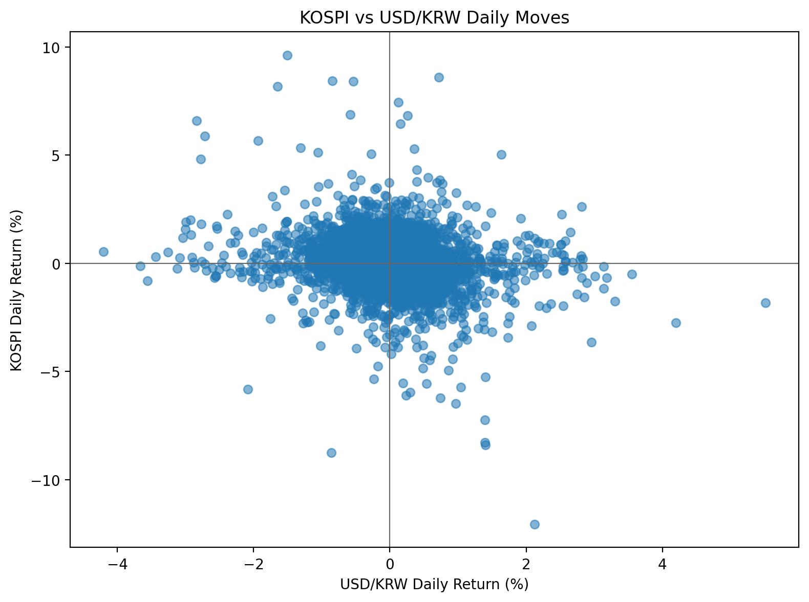
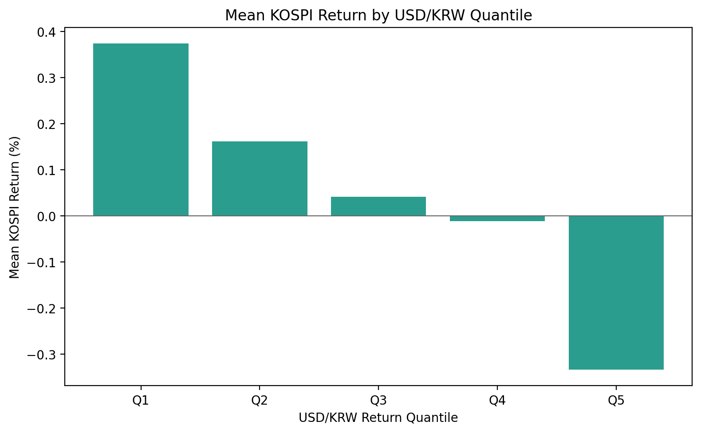
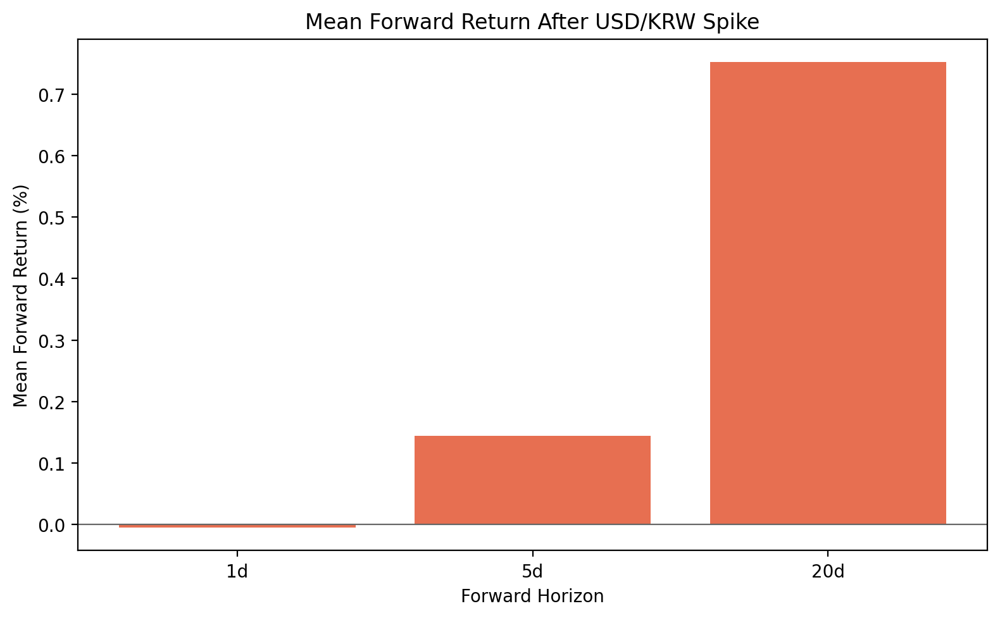
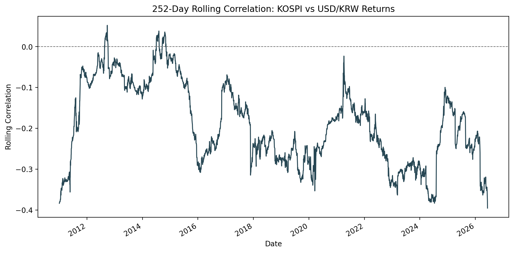

# Week 1. 달러가 강하면 KOSPI는 정말 약할까?

## 1. 이번 주 질문

이번 주에는 USD/KRW 환율이 오른 날, 혹은 환율 상승 폭이 컸던 구간에서 KOSPI 수익률이 실제로 낮았는지를 점검했다. 시장에서는 "달러가 강하면 한국 증시는 약하다"는 설명이 자주 등장하지만, 이런 문장이 일별 데이터에서도 반복적으로 관찰되는지는 따로 검증할 필요가 있다.

## 2. 왜 이 질문이 중요한가

환율은 한국 주식시장을 해석할 때 가장 자주 인용되는 변수 중 하나다. 원화가 약세를 보일 때 외국인 수급, 위험회피 심리, 대외 불확실성 같은 설명이 함께 따라오지만, 실제 시장에서는 여러 힘이 동시에 작동한다. 따라서 단일 문장으로 관계를 단정하기보다, 관측 가능한 데이터를 통해 통념이 어느 정도까지 맞는지 확인하는 과정이 의미가 있다.

이 질문은 특히 "시장 설명이 데이터로도 유지되는가"를 검증하는 출발점으로 유용하다. 교육 및 포트폴리오 목적의 분석에서는 정답을 단정하기보다, 어떤 관계가 보이고 어디서부터 해석이 조심스러워지는지를 구조적으로 보여 주는 것이 더 중요하다.

## 3. 데이터

- 데이터 출처: `yfinance`
- KOSPI 지수: `^KS11`
- USD/KRW 환율: `KRW=X`
- 분석 기간: `2010-01-04 ~ 2026-06-09`
- 관측치 수: `4,030`개 일별 관측치
- 이벤트 표본 수: 환율 급등 이벤트 `403`회

두 시계열은 날짜 기준으로 inner join하여 공통 관측치만 사용했다. 일별 종가 기준 수익률을 계산했으며, 이는 장중 반응이 아니라 하루 단위의 종가 변화에 초점을 둔 분석이라는 뜻이기도 하다.

## 4. 분석 방법

1. KOSPI와 USD/KRW 종가 데이터를 수집하고 날짜 기준으로 정렬했다.
2. 두 데이터를 inner join하여 공통 거래일만 남겼다.
3. `kospi_return`, `usdkrw_return` 일별 수익률을 계산했다.
4. KOSPI 일별 수익률과 USD/KRW 일별 변화율의 전체 기간 상관관계를 계산했다.
5. USD/KRW 일별 변화율을 5개 분위수로 나누고, 각 분위수별 KOSPI 평균 수익률, 중앙값, 표본 수, 상승 확률을 계산했다.
6. USD/KRW 일별 변화율 상위 10%를 환율 급등 이벤트로 정의하고, 이후 1일, 5일, 20일 KOSPI forward return을 요약했다.
7. 관계가 시간에 따라 달라지는지 보기 위해 252거래일 롤링 상관관계를 추가로 계산했다.

## 5. 결과 요약

- 전체 기간에서 KOSPI 일별 수익률과 USD/KRW 일별 변화율은 음의 상관관계를 보였다.
- 환율이 크게 오른 날에는 KOSPI 평균 수익률이 낮게 나타났다.
- 다만 환율 급등 이후 5일, 20일 forward return은 플러스로 나타나, 단순히 “환율 상승 = 이후 지속 하락”이라고 보기는 어렵다.

수치로 보면 전체 기간 상관계수는 `-0.190987`이었다. 방향은 음수였지만, 절대값이 매우 큰 수준은 아니어서 "항상 강하게 반대로 움직였다"고 말하기에는 조심스러운 결과다.

분위수 분석에서는 환율이 크게 하락한 날에 해당하는 Q1에서 KOSPI 평균 수익률이 약 `+0.374%`, 환율이 크게 상승한 날에 해당하는 Q5에서는 약 `-0.334%`였다. 상승 확률도 Q1은 약 `63.4%`, Q5는 약 `40.7%`로 차이가 났다. 적어도 일별 단면에서는 환율 급등일수록 KOSPI 성과가 약해지는 방향이 관찰됐다.

이벤트 스터디에서는 환율 급등일 이후 KOSPI 평균 forward return이 1일 `-0.005%`, 5일 `+0.144%`, 20일 `+0.752%`였다. 단기적으로는 거의 보합에 가까웠고, 5일과 20일 평균은 플러스였다. 252거래일 롤링 상관관계는 평균 `-0.190`, 최근 값 `-0.395`, 최대 `0.052`, 최소 `-0.395`로 나타나 시기별로 관계 강도가 달라졌음을 보여 줬다.

## 6. 차트와 표

- 요약 표: `outputs/tables/summary_table.csv`
- 분위수 분석 표: `outputs/tables/quantile_summary.csv`
- 이벤트 스터디 표: `outputs/tables/event_study_summary.csv`
- 롤링 상관관계 표: `outputs/tables/rolling_correlation.csv`

## 7. 해석

전체 기간 평균만 보면 USD/KRW 상승과 KOSPI 약세 사이에는 음의 관계가 있었다. 이는 USD/KRW 상승이 한국 주식시장에 대한 위험회피 심리와 연결될 수 있다는 시장 설명과 어느 정도 맞닿아 있다. 실제로 분위수 분석에서도 환율 상승 폭이 큰 날일수록 KOSPI 평균 수익률이 낮아지는 방향이 확인됐다.

다만 USD/KRW는 순수한 달러 강세 지표가 아니다. 이 변수에는 달러 자체의 강세뿐 아니라 원화 약세 요인이 함께 섞여 있다. 다시 말해, "환율이 오른다"는 현상 하나만으로 달러 측 요인과 한국 측 요인을 깔끔하게 분리할 수 없다.

또한 KOSPI와 환율은 둘 다 글로벌 위험선호, 금리, 외국인 수급, 경기 기대 같은 공통 요인의 영향을 받는다. 따라서 이번 결과는 인과관계를 증명하는 결론이라기보다, 널리 쓰이는 시장 통념을 데이터로 검증해 보는 출발점에 가깝다. 상관관계가 존재하더라도 그것만으로 어느 변수가 다른 변수를 직접 움직인다고 말할 수는 없다.

특히 롤링 상관관계는 이 관계가 시간에 따라 달라질 수 있음을 보여 줬다. 252거래일 기준 상관관계는 어떤 구간에서는 거의 0에 가까워졌고, 어떤 구간에서는 더 강한 음의 관계를 보였다. 이는 전체 기간 평균 하나가 위기 국면과 평상시 국면의 차이를 가릴 수 있다는 뜻이기도 하다.

## 8. 한계

- 상관관계는 인과관계가 아니다.
- USD/KRW는 순수한 달러 강세 지표가 아니다.
- 일별 데이터라 장중 반응을 보지 못한다.
- 환율과 KOSPI의 거래일 정합성 문제가 있을 수 있다.
- 전체 기간 평균은 위기 국면과 평상시 국면의 차이를 가릴 수 있다.
- 거래비용, 실제 투자 가능성, 환헤지 여부는 고려하지 않는다.

## 9. 포트폴리오/면접 활용 문장

- 데이터 분석 관점: "환율과 주가지수의 관계를 단일 상관계수로 끝내지 않고, 분위수 분석과 이벤트 스터디, 252거래일 롤링 상관관계까지 확장해 시계열 관계를 구조적으로 점검했습니다."
- 금융시장 해석 관점: "USD/KRW와 KOSPI가 함께 움직이는 방향만 보는 것이 아니라, 위험회피 심리와 달러 강세·원화 약세 요인이 섞여 있을 수 있다는 점까지 함께 해석했습니다."
- 한계 인식 관점: "상관관계를 인과관계로 오해하지 않도록 한계를 먼저 정리했고, 전체 기간 평균이 국면별 차이를 가릴 수 있다는 점을 별도 롤링 분석으로 보완했습니다."

## 10. 확장 아이디어

- DXY를 추가해 USD/KRW와 순수 달러 강세 지표를 분리해서 비교하기
- 외국인 순매수 데이터를 추가해 환율과 수급이 함께 움직이는지 보기
- 위기 국면과 평상시 국면을 분리해 관계의 비대칭성 점검하기
- KOSPI 업종별 환율 민감도를 비교해 지수 내부 차이 보기
- 환율 변화율의 lag를 활용해 선행성이 있는지 추가로 확인하기
